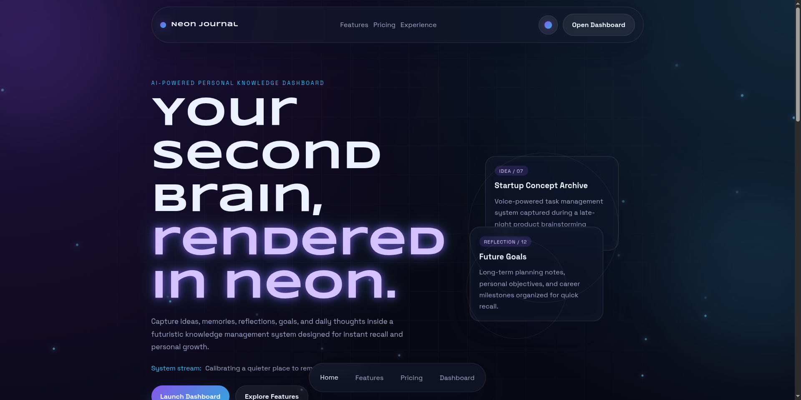
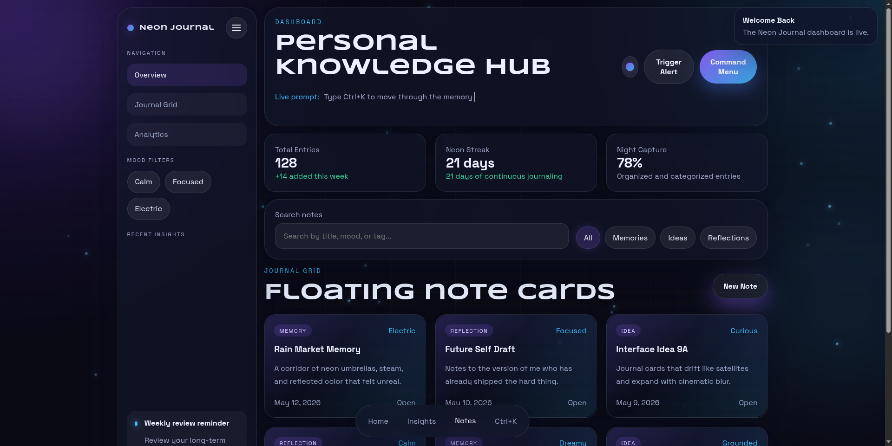

# Neon Journal

A futuristic Personal Knowledge Management (PKM) and Second Brain dashboard built with HTML, CSS, and JavaScript.

## Features

- Futuristic cyberpunk-inspired UI
- Glassmorphism design system
- Personal knowledge dashboard
- Note, idea, and reflection management
- Search and filtering interface
- Dark / Light theme support
- Responsive design
- Pure HTML, CSS, and JavaScript

## Preview

### Landing Page



### Dashboard



## Project Structure

```text
Neon-Journal/
│
├── assets/
├── screenshots/
│   ├── landing-page.png
│   └── dashboard.png
│
├── index.html
├── dashboard.html
└── README.md
```

## Run Locally

```bash
git clone https://github.com/ArpDarkDesign/neon-journal.git
cd neon-journal
```

Open `index.html` in your browser.

## Technologies

- HTML5
- CSS3
- JavaScript

## Author

Arun